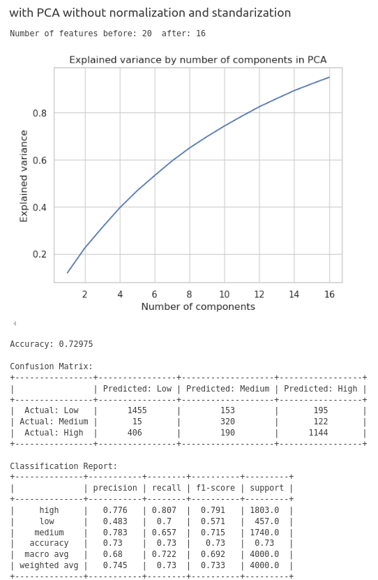
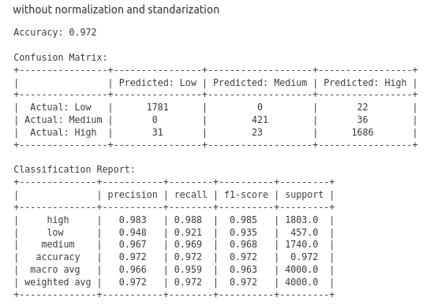
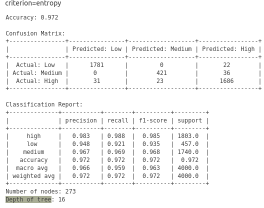

## Raport 4 - Jakub Ner

### 1. Data Exploration
I started for inspecting the data:
- There are 5 columns and 20 000 rows. 
- There are no NaN values in the dataset.
- All values are categorical

In order to examine data characteristics I ploted pareto charts for each feature

The key observation is that target values lack balance, with "low" values representing only 10% of the dataset.

### 2. Data Preprocessing

#### 2.1. One-hot encoding
I used one-hot encoding to convert categorical features to numerical. I dropped 1 level of each feature to avoid redundancy and multicollinearity. 
 > One-hot (resp. one-cold) encoding creates co-linearity if all the features are used. Simply because the following relation always holds: ∑ifi=1, So dropping one feature destroys the colinearity and it can have better results, since many models (esp. linear models) get confused with colinearities in the features.
source: https://datascience.stackexchange.com/questions/96526/two-questions-about-one-hot-encoding-drop-first-and-features-with-thousands-of

#### 2.2. Feature standardization
I used StandardScaler to standardize the columns according to the forumla `z = (x - u) / s` where `u` is the mean of the training samples and `s` is the standard deviation of the training samples.
This operation assumes that the data is normally distributed within each feature and scales them such that the distribution is now centred around 0, with a standard deviation of 1.

#### 2.3. Samples normalization
I scaled each sample by dividing its values by euclidean norm (l2) of the sample. This operation ensures that the samples are on the same scale.

*Note: One hot encoded categorical values does not contains diversed weights (the values are 0 or 1). Moreover, it refers to all features in the dataset. Therefore those are not important for the model itself, but the PCA requires all predictors to be on the same scale.*

#### 2.4. Dimensionality reduction - PCA
To reduce number of features I used Principle Component Analysis to explain 95% of variance. This lead to dimensionality reduction from 20 to 17 features. 

### 3. Classification

#### 3.1. Gaussian Naive Bayes
Gaussian Naive Bayes is a simple probabilistic classifier based on applying Bayes' theorem with naive independence assumptions between the features.

##### 3.1.1. Impact of normalization and standarization
I compared the results of the model with and without normalization and standarization. For this benchmark I didn not utilize PCA. Standarization and normalization, when applied separetely, did not have a significant impact on the model performance. However, when applied together and in the correct order - first standarization, then normalization, the model accuracy improved by 11 percentage points. After standardization, all features have the same variance, and normalization further adjusts the scale without altering the standardized distribution significantly.

  

  
  

  
  

#### 3.1.2 Impact of PCA
Normalization and standarization make the result worse, because those cause that less features are dropped during the PCA. It impacts the model performance.  

  
  
  

#### 3.2. Decision Tree

##### 3.2.1. Impact of normalization and standarization
Normalization and standarization does not impact the model performance in terms of accuracy
.
> Decision trees do not require feature scaling or normalization, as they are invariant to monotonic transformations. They can also easily handle missing values and outliers, making them suitable for raw and noisy data.

Nevertheless, it can decrease number of nodes in the tree by over a half and decrease 2 levels of depth.

 

  
  

  
  

#### 3.2.2 Impact of PCA
Similarly, PCA modifies only the structure of the model, what hypotetically for a bigger model may decrease chance of overfitting and improve inference time. 

  
  
  

#### 3.3. SVM

##### 3.3.1. Impact of normalization and standarization

  
  

  
  

#### 3.3.2. Impact of PCA

  
  
  

#### Hyperparameters benchmarks

#### Decision Tree
I tested the impact of the following hyperparameters on the normalized, then stadardized with PCA model:

1. max_depth: 5 vs 10 vs 15
The best results are for max_depth=15, but there is a change of overfitting.

  
  
  

2. criterion: entropy vs gini vs log_loss
Those hyperparameters affects number of nodes and depth of the tree. The best results are for gini criterion, because

  
  
  

3. min_samples_split: 1 vs 3 vs 5
There is no significant difference between the results. It is worth noting that depth decreases with the increase of min_samples_split, because requiring more samples to split a node results in fewer splits overall, leading to a simpler and shallower tree structure

  
  
  

#### References
https://towardsdatascience.com/whats-the-best-way-to-handle-nan-values-62d50f738fc
https://www.datacamp.com/tutorial/decision-trees-R
https://stats.stackexchange.com/questions/399430/does-categorical-variable-need-normalization-standardization
https://stackoverflow.com/questions/39120942/difference-between-standardscaler-and-normalizer-in-sklearn-preprocessing

