## Preparation
I converted all 100 [Jester](https://eigentaste.berkeley.edu/dataset/) jokes into exmbeddings usinig Bert Base Cased model -  a transformer-based language model (100 mln parameters).

I loaded all ratings (73421, 101) into numpy array and dropped the 1st column (number of rated jokes by a user) as it was not providing any useful information. I changed 99 values into null for easier agregations handling. I calculated mean for each joke, to further use it as a target variable.

Also I plotted boxplot for each joke to see the distribution of ratings and the outliers. This analysis revealed that jokes with numerous outliers generally have higher overall ratings, with the outliers themselves predominantly consisting of negative ratings. This suggests that these jokes are perceived as funny but also elicit offensive or inappropriate reactions from some individuals. For example Joke 50th is about catholic priest and a jewish, 36th is about Pole stereotype, 27 is related to politics.
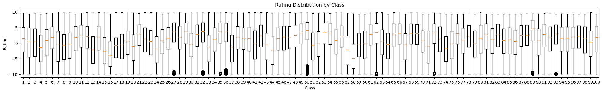

I splitted the data into validation and the rest (10/90) and then used the rest for cross validation. I picked this kind of split to use more data for traning.

## MLP
I used `MLPRegressor` from sklearn. *"This model optimizes the squared error using LBFGS or stochastic gradient descent."* - from the official documentation. I set parameters to: learning_rate=constant, activation=relu, solver=sgd, alpha=0.0. And then I tried different combination to find the best one and inquire the impact of the parameters on the model performance. For training the model I used partial_fit method to incrementally update the model with new data.

### Default parameters
Test error  decreases during subsequent epochs, but around the 60th epoch, the model starts overfitting. Weight distribution shows that most parameters is close to 0, what suggest that number of neurons is too high in comparison to the number of samples, even though I applied cross validation. 

  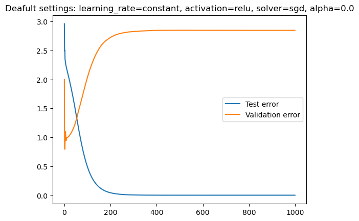
  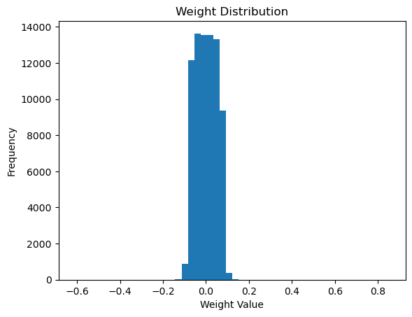

### Impact of learning rate
To investigate the impact of different learning rates on the performance of the MLPRegressor model, I experimented with three options: 'constant', 'adaptive', and 'invscaling'. In addition to the learning rates, I also explored different initialization rates, including 0.0001, 0.001, 0.01, and 0.1. The initialization rate determines the magnitude of the initial random weights assigned to the model's neurons. It can affect the convergence speed and the likelihood of getting stuck in local minima. Also across different learning rates, the bigger the initialization rate, the more weights are close to 0.

#### Constant learning rate
The 'constant' learning rate keeps the learning rate constant throughout the training process. This means that the model updates its parameters with the same step size at each iteration. If the learning rate is too high, the model may overshoot the optimal solution and fail to converge. If the learning rate is too low, the model may take a long time to converge or get stuck in a local minimum.

  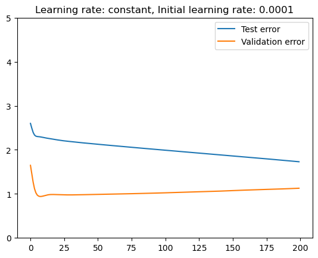
  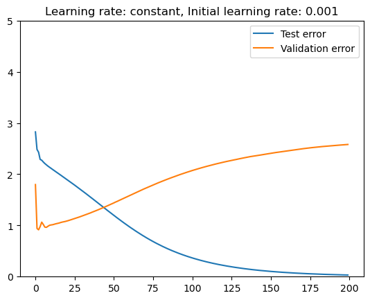
  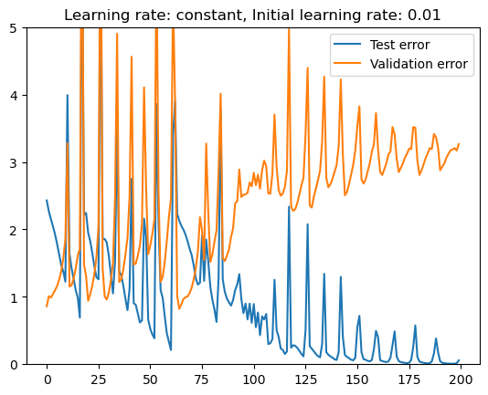
  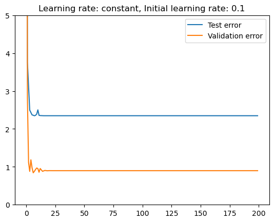

#### Adaptive learning rate
The 'adaptive' learning rate adjusts the learning rate based on the progress of the training. It decreases the learning rate when the training loss stops improving, allowing for finer adjustments to the parameters. This leads to extremely slow convergence for small initial rates, but can improve the results for bigger ones, by avoiding overshooting the optimal solution.

  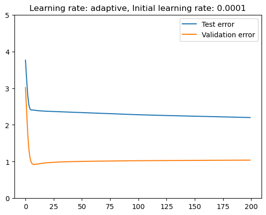
  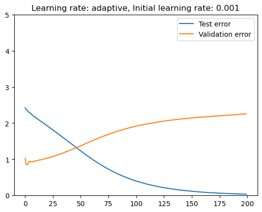
  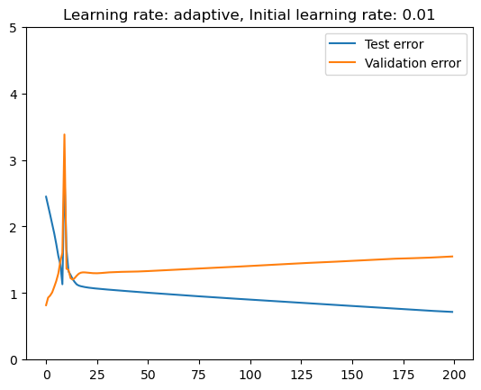
  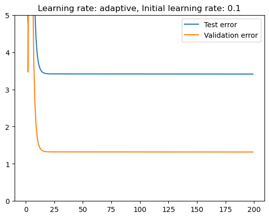

#### Invscaling learning rate
The 'invscaling' learning rate decreases the learning rate over time. It scales the learning rate by an inverse of the current iteration number, which can help the model converge more slowly and avoid overshooting the optimal solution. This leads to even slower convergence for small initial rates, but can improve the results for bigger ones, by avoiding overshooting the optimal solution.

  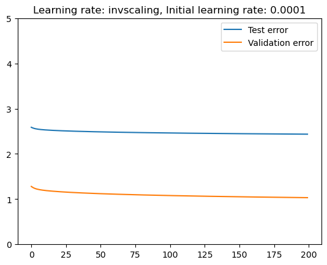
  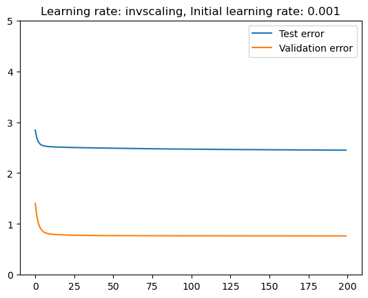
  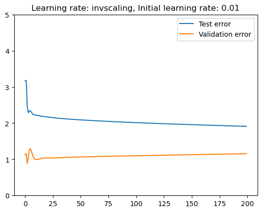
  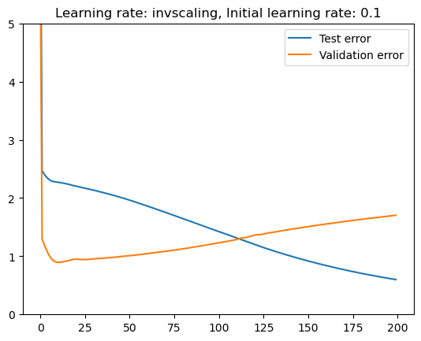

### Impact of hidden layers
To investigate the impact of different numbers of hidden layers on the performance of the MLPRegressor model, I experimented with 1 or 2 different layers with 10, 50, 100 neurons per layer.

Since number of samples is very small adding more layers or neurons does not improve the model performance. Opposite, it leads to overfitting. The best results were achieved with 1 hidden layer and 10 neurons.

  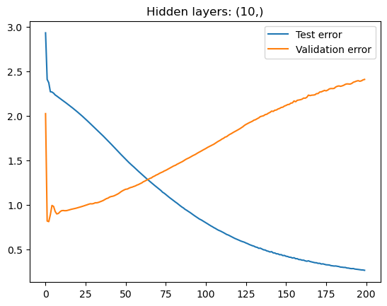
  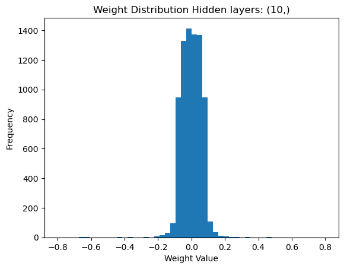

  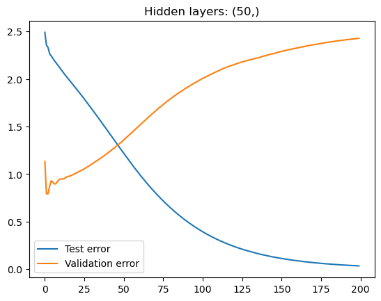
  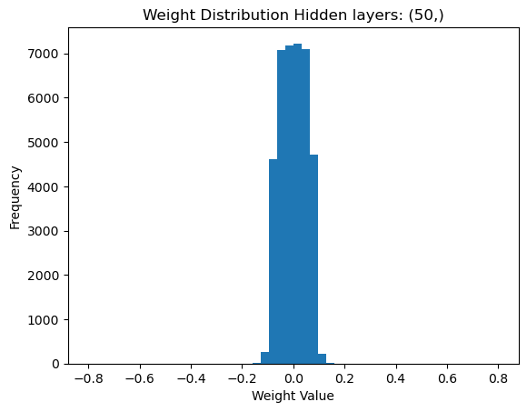

  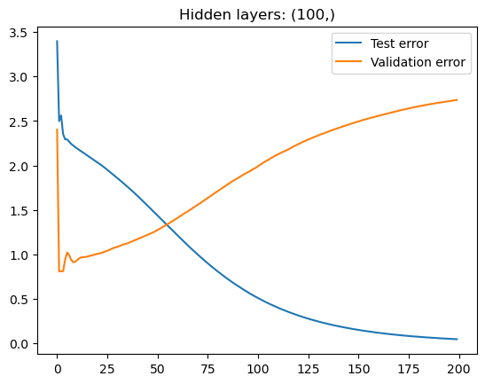
  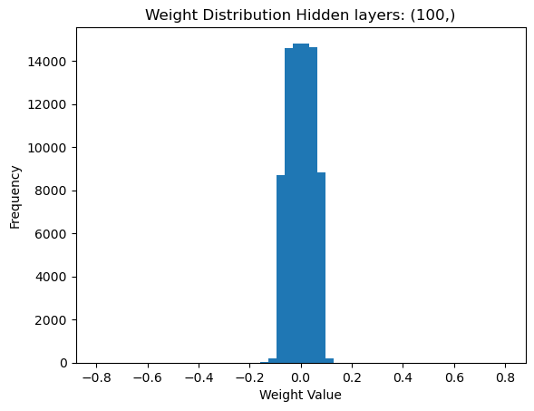

  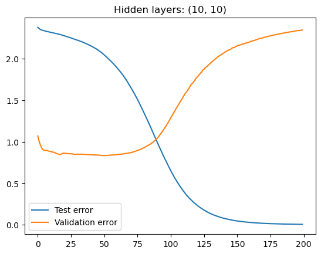
  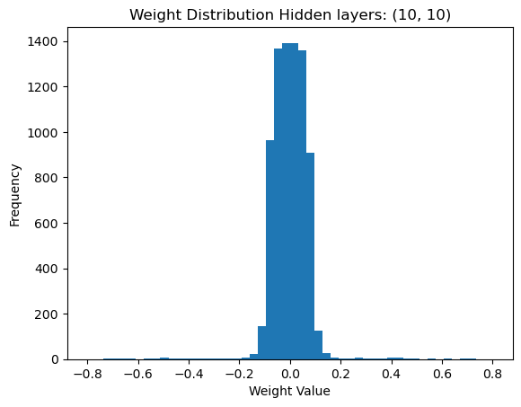

  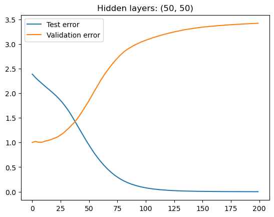
  

  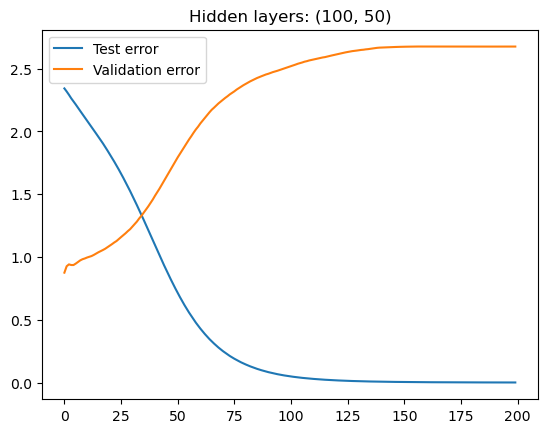
  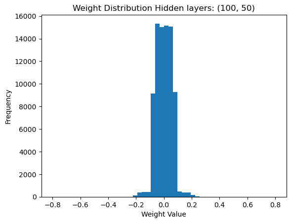

  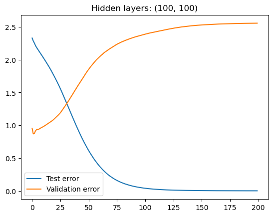
  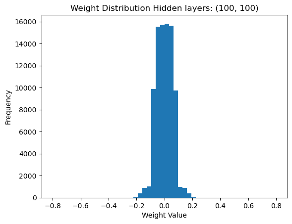

