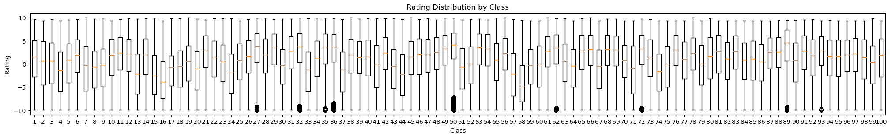
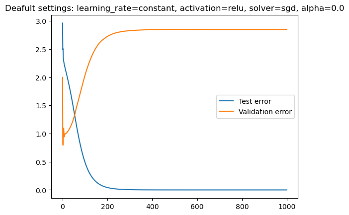

## Preparation
I converted all 100 [Jester](https://eigentaste.berkeley.edu/dataset/) jokes into exmbeddings usinig Bert Base Cased model -  a transformer-based language model (100 mln parameters).

I loaded all ratings (73421, 101) into numpy array and dropped the 1st column (number of rated jokes by a user) as it was not providing any useful information. I changed 99 values into null for easier agregations handling. I calculated mean for each joke, to further use it as a target variable.

Also I plotted boxplot for each joke to see the distribution of ratings and the outliers. This analysis revealed that jokes with numerous outliers generally have higher overall ratings, with the outliers themselves predominantly consisting of negative ratings. This suggests that these jokes are perceived as funny but also elicit offensive or inappropriate reactions from some individuals. For example Joke 50th is about catholic priest and a jewish, 36th is about Pole stereotype, 27 is related to politics.

I splitted the data into validation and the rest (10/90) and then used the rest for cross validation. I picked this kind of split to use more data for traning.

## MLP
I used `MLPRegressor` from sklearn. *"This model optimizes the squared error using LBFGS or stochastic gradient descent."* - from the official documentation. I set parameters to: learning_rate=constant, activation=relu, solver=sgd, alpha=0.0. And then I tried different combination to find the best one and inquire the impact of the parameters on the model performance. For training the model I used partial_fit method to incrementally update the model with new data.

